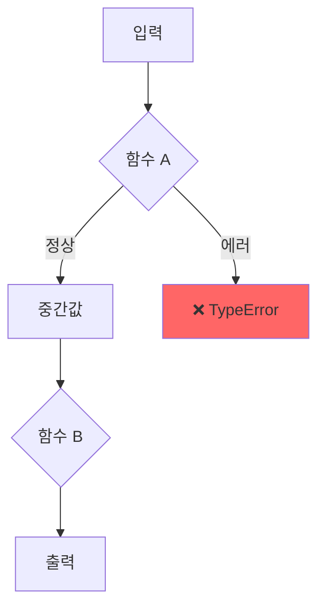

# Skill 17: Debugging Canvas

## 목적
버그를 시각적으로 분석·추적하는 디버깅 캔버스를 생성한다.
에러 흐름, 콜스택, 데이터 변환 과정을 다이어그램으로 시각화.

## 트리거
- "디버그", "버그 분석", "debugging canvas", "에러 추적" 언급
- 복잡한 에러 발생 시 자동 제안

## 실행 흐름

### 1. 에러 정보 수집
```
- 에러 메시지 + 스택 트레이스
- 관련 파일/함수 목록
- 입력 데이터 → 예상 출력 → 실제 출력
- 최근 변경 사항 (git diff)
```

### 2. 디버깅 캔버스 생성


### 3. 캔버스 구성 요소
```
[에러 위치 하이라이트]
  - 코드 라인 번호 + 파일 경로
  - 변수 상태 스냅샷

[콜스택 시각화]
  - 함수 호출 순서 (화살표)
  - 각 함수의 입력/출력 값

[데이터 흐름]
  - 변수가 어디서 변형되는지
  - null/undefined 발생 지점

[관련 코드 스니펫]
  - 에러 발생 전후 5줄
  - 의심되는 조건문/분기
```

### 4. 수정 제안
```
- Root Cause 1줄 요약
- Fix 코드 (diff 형식)
- 재발 방지 테스트 코드
```

## 출력
- `docs/YYYY-MM-DD/debug-canvas-{issue}.md` — Mermaid 다이어그램 포함
- 콘솔: 에러 원인 + 수정 제안

## MCP 연동
- **Mermaid Chart MCP**: 다이어그램 렌더링
- **playwright MCP**: UI 버그 시 스크린샷 캡처
