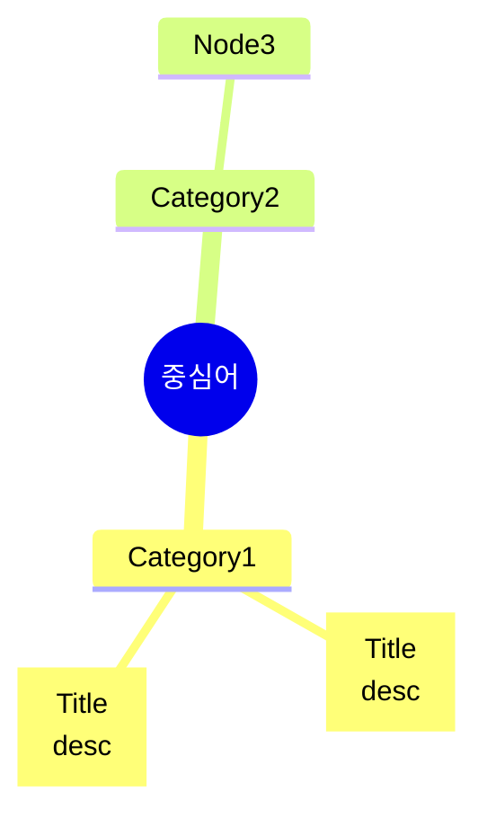

# Skill: Architecture Mindmap

## 목적
복잡한 시스템·제품·프로젝트의 **전체 영역**을 1장에 압축. 중앙 로고 → 4~6개 카테고리 → 카테고리당 3~5개 노드.

## 트리거 (자동 활성화 키워드)
- "마인드맵", "전체 그림", "한 장에 다", "한눈에", "전체 맵", "방사형"
- 영어: "mindmap", "overview", "everything map", "big picture"
- **자동 판단 신호**: 주제가 "여러 독립된 영역을 동시에 보여줘야 함" (단계·순서·층 없음)

## 디자인 규칙 (Ruben Hassid 스타일)

### 색상 팔레트
```
배경: 크림 (#FAF6F1)
중앙 로고: 살구색 (#E89B7A) 원형
카테고리 라벨: 차콜 (#2D2D2D) 검은 박스 + 흰 글씨
노드 박스 (밝은 영역): 살구색 (#F4B891)
노드 박스 (어두운 영역): 베이지 (#E8DCC4)
연결선: 얇은 회색 (#999999) 1px
```

### 레이아웃
```
                Category 1
                   |
         ┌─────────┼─────────┐
        Node      Node      Node
                   |
Cat 2 ─── [중앙 로고/이름] ─── Cat 3
                   |
        Node      Node      Node
         └─────────┼─────────┘
                Category 4
```

### 텍스트 분량 (노드당)
- 제목: 1~3 단어 (큰 글씨)
- 설명: 1~2 문장 (작은 글씨)
- 너무 길면 자르고 핵심만

## 실행 흐름

### Step 1 — 구조 추출
사용자 주제에서:
1. 중심어 1개
2. 카테고리 4~6개 (직각 분류)
3. 카테고리당 노드 3~5개

JSON 으로 정리:
```json
{
  "center": "프로젝트명",
  "categories": [
    {"name": "Work Modes", "nodes": [
      {"title": "Chat", "desc": "기본 대화"},
      {"title": "Code", "desc": "터미널에서 코드"}
    ]}
  ]
}
```

### Step 2 — 렌더링 도구 선택 (우선순위)
1. **Mermaid mindmap** (1순위): 가장 빠르고 무료, 텍스트로 정의
2. **python-pptx** (2순위): 정밀 제어, PPT 직접 생성
3. **Canva MCP** (3순위): 디자인 퀄리티 최고
4. **Gamma MCP** (4순위): 프롬프트 한 줄

### Step 3 — Mermaid 코드 생성 (1순위 경로)


### Step 4 — 출력
- `outputs/arch/mindmap-{topic}-{YYYY-MM-DD}.{md,png,pptx}`
- 동시 저장: `.md` (Mermaid 원본) + `.png` (렌더 결과)

## 품질 체크
- [ ] 중심어가 한눈에 보임
- [ ] 카테고리 4~6개 (3 미만·7 초과 금지 — 시각 부하)
- [ ] 노드 텍스트 3줄 이하
- [ ] 좌우/상하 균형 맞음

## 안티패턴
- ❌ 노드가 7개 이상인 카테고리 (분할 필요)
- ❌ 카테고리 7개 이상 (계층 추가)
- ❌ 노드에 긴 문단 (요약 필요)
